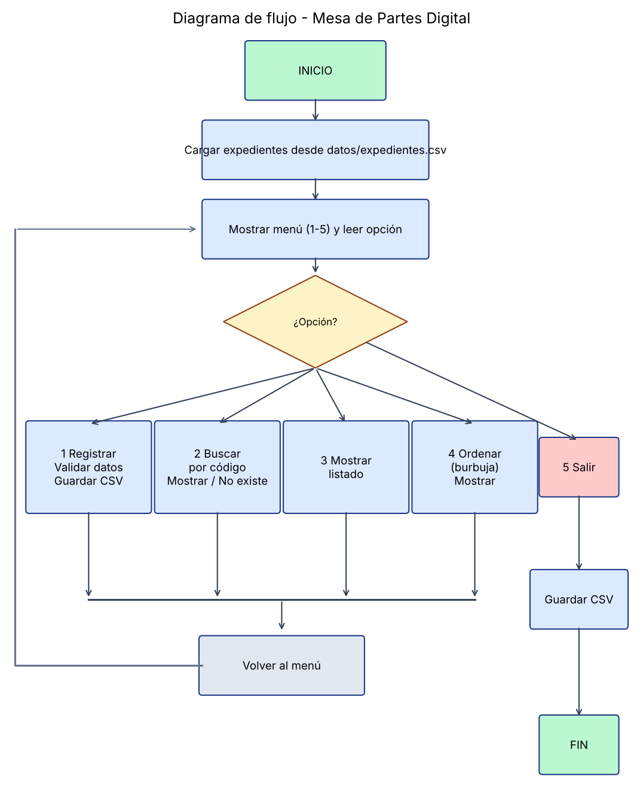

# Estructura modular



```
main.py
 ├── registro.py        ── validaciones.py
 ├── consultas.py       ── persistencia.py
 ├── ordenamiento.py    ── persistencia.py
 └── persistencia.py    ── datos/expedientes.csv
```

| Módulo | Función | Responsable |
|---|---|---|
| `main.py` | Menú y flujo principal | Jhonny |
| `registro.py` | `registrar_expediente()`, `generar_codigo_sugerido()` | Victor |
| `validaciones.py` | `validar_codigo/dni/nombre/tipo_documento/descripcion/fecha` | Victor |
| `persistencia.py` | `guardar_expedientes()`, `cargar_expedientes()` | Sebas |
| `consultas.py` | `buscar_expediente()`, `mostrar_expedientes()`, `mostrar_todos()`, `mostrar_detalle_expediente()` | Sebas |
| `ordenamiento.py` | `ordenar_expedientes()`, `clave_orden()` | Sebas |
| `exportar_sql.py` | CSV → INSERT MySQL | Aaron |

## Cambios respecto al diseño inicial (para que diseño y código coincidan)

| Diseño inicial | Código final |
|---|---|
| `expedientes.py` | `registro.py` + `validaciones.py` |
| `archivos.py` | `persistencia.py` |
| `busqueda.py` | `consultas.py` |
| `base_datos.py` | `database/*.sql` + `exportar_sql.py` |
| `datos/expedientes.txt` | `datos/expedientes.csv` |
